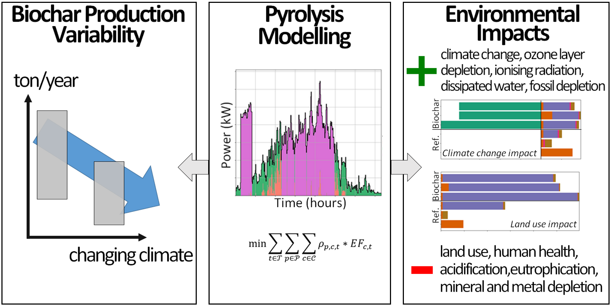

# P2_farm_biochar

This repository contains the python code used in the manuscript "Small-scale biochar production on Swedish farms: a model for estimating potential, variability, and environmental performance".

DOI: https://doi.org/10.1016/j.jclepro.2020.124873

### Graphical Abstract

### Abstract ###
Several small-scale pyrolysis plants have been installed on Swedish farms and uptake is increasing in the Nordic countries. Pyrolysis plants convert biomass to biochar for agricultural applications and syngas for heating applications. These projects are driven by ambitions of achieving carbon dioxide removal, reducing environmental impacts, and improving farm finances and resilience. Before policy support for on-farm pyrolysis projects is implemented, a comprehensive environmental evaluation of these systems is needed. Here, a model was developed to jointly: (i) simulate operation of on-farm energy systems equipped with pyrolysis units; (ii) estimate biochar production potential and its variability under different energy demand situations and designs; and (iii) calculate life cycle environmental impacts. The model was applied to a case study farm in Sweden. The farm’s heating system achieved net carbon dioxide removal through biochar carbon sequestration, but increased its impact in several other environmental categories, mainly due to increased biomass throughput. Proper dimensioning of heat-constrained systems is key to ensure optimal biochar production, as biochar production potential of the case farm was reduced under expected climate change in Sweden. To improve the environmental footprint of future biochar systems, it is crucial that expected co-benefits from biochar use in agriculture are realised. The model developed here is available for application to other cases.

## Structure

The repository is structured as follows:

    .
    ├── farm_biochar_model                   # Core scripts
    │   ├ farm_demand.py                        # calculate farm energy demand
    │   ├ farm_supply.py                        # define equipment available on farm
    │   ├ farm_ficus.py                         # unit commitment solver (adapted from ficus - https://github.com/yabata/ficus)
    │   ├ farm_bw2.py                           # calculate indicators and generalte LCA inventory (based on brightway2 - https://github.com/brightway-lca)
    │   ├ lcopt_multi_tagged.py                 # useful functions (from lcopt - https://github.com/pjamesjoyce/lcopt)
    │   ├ farm_ficus_input_template.xlsx        # template input file to ficus
    │   └ farm_supply_plants.xlsx               # list of equipment available for scenarios, new plant can be added here 
    │     
    ├── ex0_template                         # Template for new project
    │
    ├── ex1_Lindeborg                        # Case study at Lindeborg's farm
    │   ├ input_files                           # e.g. electricity data, weather data
    │   ├ output_files                          # e.g. ficus generated results, figures, filelog.csv
    │   ├ 1_run scenarios.ipynb                 # notebook where simulations are defined and run
    │   ├ 2_analyse scenarios.ipynb             # notebook where simulations are analysed, figures plotted
    │   └ 3_bonus_dimensioning analysis.ipynb   # notebook for other purposes
    │
    ├── requirements.txt
    └── README.md

## Dependencies & credits

This work relies on other libraries, including:
- ficus, https://github.com/yabata/ficus
- brightway2, https://github.com/brightway-lca
- lcopt, https://github.com/pjamesjoyce/lcopt

It also uses:
- cplex, http://www.cplex.com/
- ecoinvent, https://www.ecoinvent.org/

 

